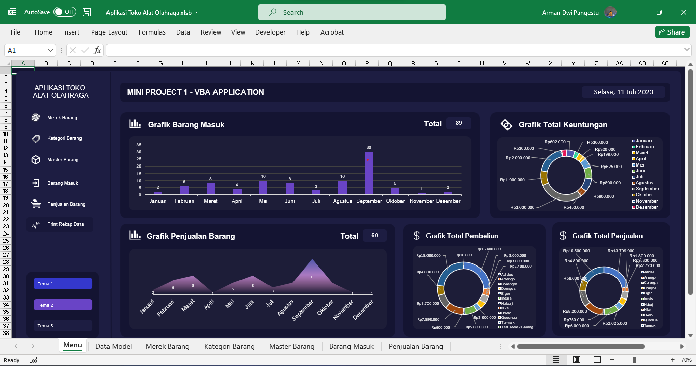

<h1 align="center">VBA - Aplikasi Toko Alat Olahraga</h1>
<p align="center">Repository ini merupakan sebuah aplikasi Toko Alat Olahraga yang memiliki fitur CRUD pada Excel dan dibuat menggunakan bahasa pemgrograman Visual Basic Application</p>



# Daftar Isi

- [UI Design](#ui-design)
  - [Dashboard](#dashboard)
  - [Form `Merek Barang`](#form-merek-barang)
  - [Form `Kategori Barang`](#form-kategori-barang)
  - [Form `Master Barang`](#form-master-barang)
  - [Form `Barang Masuk`](#form-barang-masuk)
  - [Form `Penjualan Barang`](#form-penjualan-barang)
  - [Form `Rekap Penjualan`](#form-rekap-penjualan)
- [Aturan Penamaan](#aturan-penamaan)
  - [Penamaan Name Untuk Object dan Isinya](#penamaan-name-untuk-object-dan-isinya)
  - [Penamaan Variabel, Procedure atau Function](#penamaan-variabel-procedure-atau-function)
  - [Penamaan Shape](#penamaan-shape)
- [Entity Relationship Diagram (ERD)](#entity-relationship-diagram-erd)
  - [Penjelasan ERD](#penjelasan-erd)
    - [Tabel `Merek Barang` dan `Master Barang`](#tabel-merek-barang-dan-master-barang)
    - [Tabel `Kategori Barang` dan `Master Barang`](#tabel-kategori-barang-dan-master-barang)
    - [Tabel `Master Barang` dan `Barang Masuk`](#tabel-master-barang-dan-barang-masuk)
    - [Tabel `Master Barang` dan `Penjualan Barang`](#tabel-master-barang-dan-penjualan-barang)


## UI Design

Sebelum aplikasi ini dibuat, saya terlebih dahulu membuat design aplikasi untuk masing - masing komponen di setiap sheet nya menggunakan aplikasi Figma, berikut design nya:

### Dashboard


### Form `Merek Barang`


### Form `Kategori Barang`


### Form `Master Barang`


### Form `Barang Masuk`


### Form `Penjualan Barang`


### Form `Rekap Penjualan`


## Aturan Penamaan

Sebelum saya membuat program atau coding VBA nya, saya terlebih dahulu membuat aturan penamaan agar mudah membedakan mana variable, procedure atau function, dll

### Penamaan Name Untuk Object dan Isinya

- Form
- Label
- Text Box
- Combo Box
- Command Button

Untuk penamaan name untuk Object dan isinya menggunakan `Pascal Case`, contoh:

```
FormBarangMasuk, LabelIdBarangMasuk, TextBoxIdBarangMasuk, ComboBoxMerekBarang, CmdBtnSimpan
```

### Penamaan Variabel, Procedure atau Function

Untuk penamaan variabel, procedure atau function menggunakan `Camel Case`, contoh:

```
cariById(), bersihForm(), totalStok, getBarisMerekBarang()
```

### Penamaan Shape

Untuk penamaan shape atau button trigger untuk memunculkan pop up form input untuk CRUD data menggunakan `Pascal Case`, contoh:

```
ShapeFormMerekBarang()
```

## Entity Relationship Diagram (ERD)

Sebelum saya membuat program atau coding VBA nya, saya terlebih dahulu membuat ERD (Entity Relationship Diagram) Design untuk memudahkan atau membuat gambaran bagaimana relasi antar tabel pada aplikasi ini, berikut adalah ERD dan penjelasan nya:


### Penjelasan ERD

Pada ERD aplikasi ini memiliki beberapa relasi antar tabel, berikut daftar relasi antar tabel nya:

#### Tabel `Merek Barang` dan `Master Barang`

- Tabel `merek_barang` memiliki relasi ke tabel `master_barang` melalui field `id_merek_barang`. Relasinya adalah `one-to-many`, dimana satu merek barang dapat memiliki banyak barang pada tabel `master_barang`.

#### Tabel `Kategori Barang` dan `Master Barang`

- Tabel `kategori_barang` memiliki relasi ke tabel `master_barang` melalui field `id_kategori_barang`. Relasinya adalah `one-to-many`, dimana satu kategori barang dapat memiliki banyak barang pada tabel `master_barang`.

#### Tabel `Master Barang` dan `Barang Masuk`

- Tabel `master_barang` memiliki relasi ke tabel `barang_masuk` melalui field `id_barang`. Relasinya adalah `one-to-many`, dimana satu barang dapat memiliki banyak transaksi barang masuk pada tabel `barang_masuk`.

#### Tabel `Master Barang` dan `Penjualan Barang`

- Tabel `master_barang` memiliki relasi ke tabel `penjualan_barang` melalui field `id_barang`. Relasinya adalah `one-to-many`, dimana satu barang dapat memiliki banyak transaksi penjualan barang pada tabel `penjualan_barang`.
